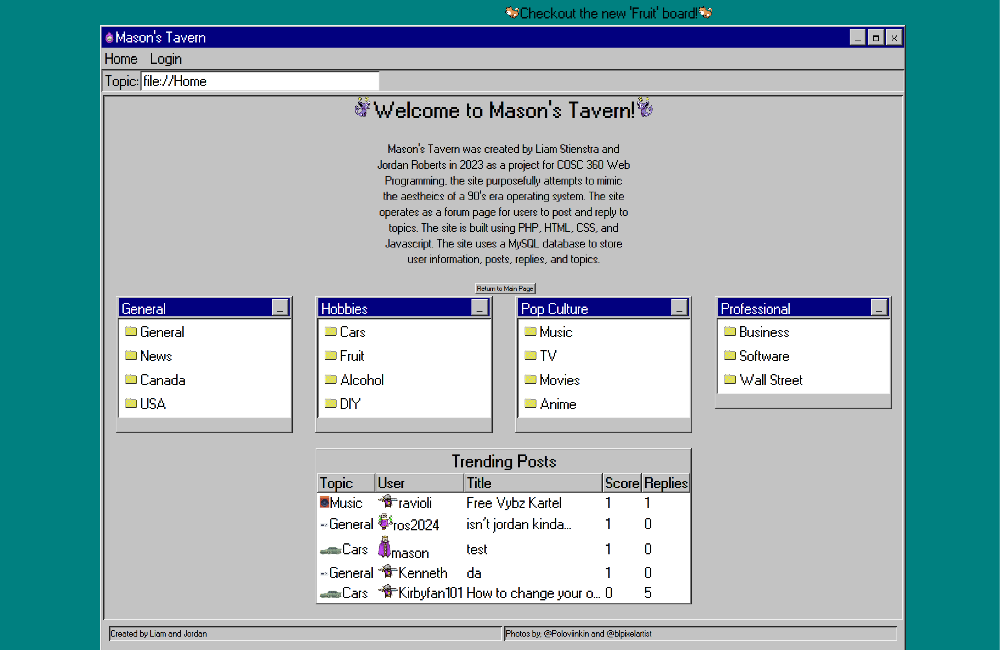
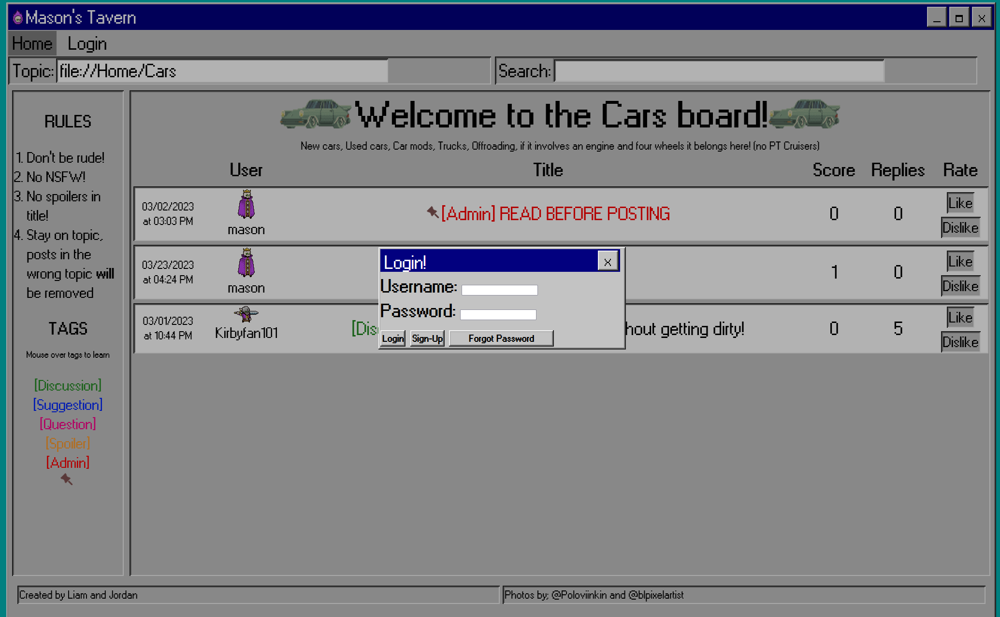
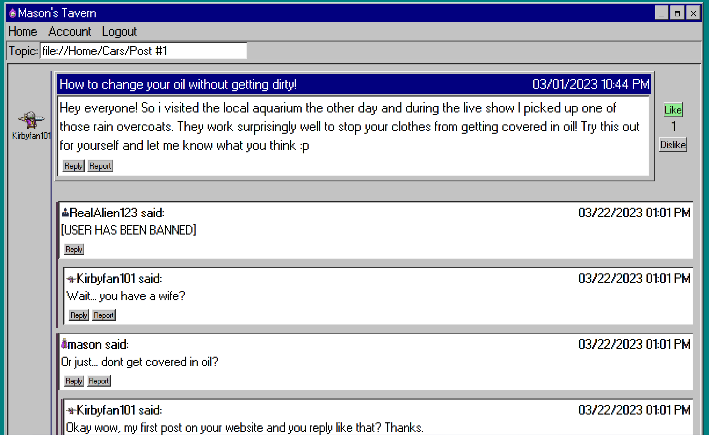
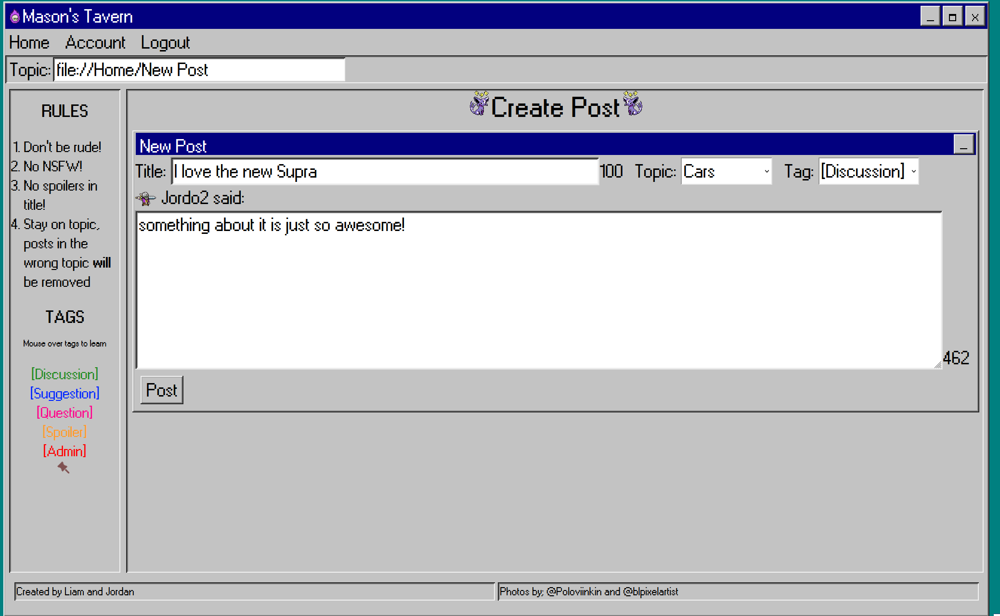
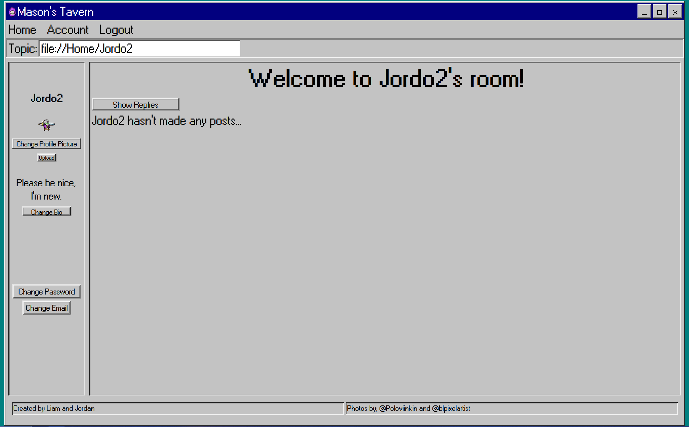
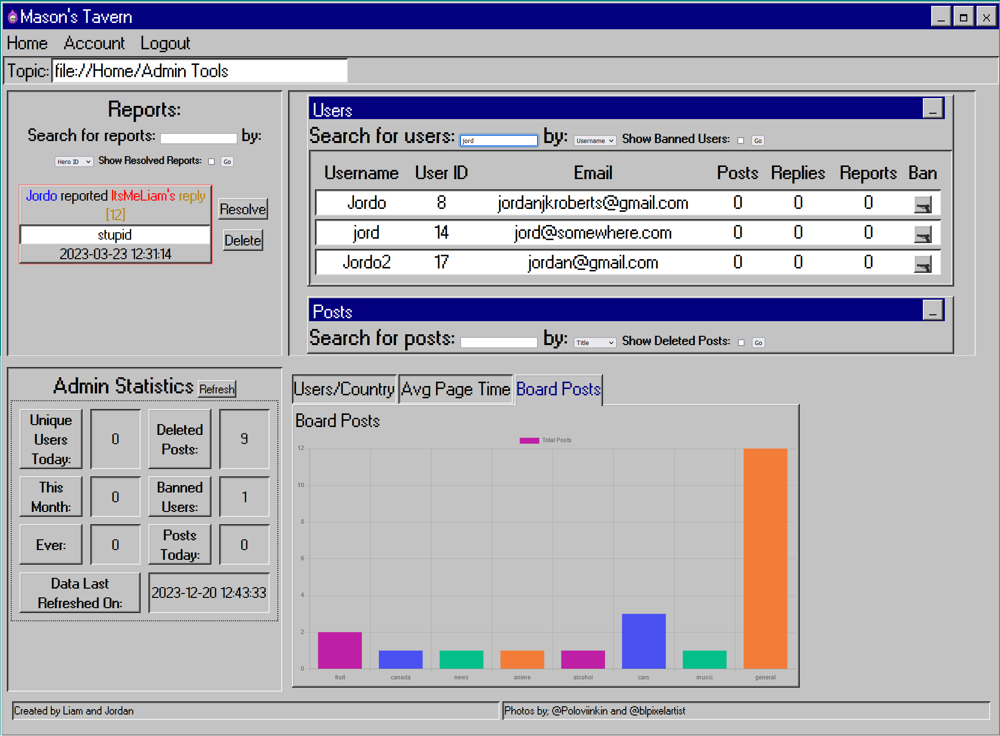

# Masons Tavern

Description: Our website will be a Forum Discussion website similar to message boards in the 90’s. Board will be based on several main categories in which users can write their own posts and comment on others.

# Requirements:
- Like/dislike system
- Categories>Posts>Replies/Comments
- Create account page with no duplicate email or username
- Easy to navigate UI system
- Colour palette which makes sense for easy/accessible browsing
- Login Securely validates username and password

# User Capabilities:
- User access to own past posts/comments
- Modify account page
- Create posts
- Reply to posts
- Profile Picture
- Browse Categories/Posts
- See other Users profiles/posts
- Like/Dislike users posts

# Admin Capabilities:
- Delete posts/comments
- Pin posts/comments
- Move posts
- Ban accounts

# Images

Home Screen

Login Screen

Post Screen

New Post

User Account Screen

Admin Portal

